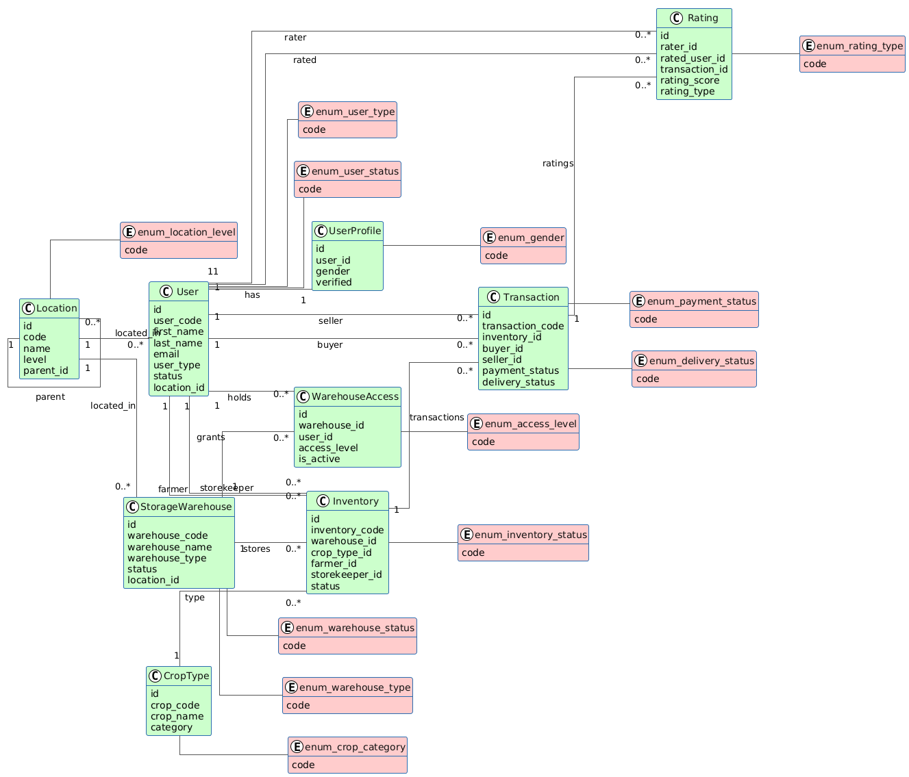

# Rangira Agro Farming

A Spring Boot application for agricultural storage and trading management in Rwanda.

## Description

Rangira Agro Farming is a digital farm management system designed to help farmers efficiently manage agricultural activities. The system provides centralized crop production tracking, warehouse management, sales recording, and user rating functionality. It implements Rwanda's five-level administrative hierarchy (Province, District, Sector, Cell, Village) using a self-referential location structure.

## Entity Relationship Diagram



The system implements 9 core entities with proper relationships including one-to-one, one-to-many, and many-to-many associations.

## Key Features

- User management with multiple roles (Farmer, Buyer, Storekeeper, Admin)
- Hierarchical location management for Rwanda administrative divisions
- Warehouse management with capacity tracking
- Crop inventory tracking with quality grading
- Transaction processing with payment and delivery status
- User rating system for quality assurance
- RESTful API with Swagger documentation

## Technology Stack

- Java 17
- Spring Boot 3.5.7
- Spring Data JPA with Hibernate
- PostgreSQL database
- Springdoc OpenAPI 2.8.1
- Maven build tool

## Database Structure

### Core Entities

1. Location - Self-referential hierarchy for administrative divisions
2. User - System users with role-based access
3. UserProfile - Extended user information
4. StorageWarehouse - Physical storage facilities
5. WarehouseAccess - Junction table for user-warehouse permissions
6. CropType - Agricultural product classifications
7. Inventory - Stored crop records
8. Transaction - Buy and sell operations
9. Rating - User feedback and ratings

### Location Hierarchy

The Location entity implements a self-referential design supporting five levels:

```
Province (parent_id = NULL)
  └─ District
      └─ Sector
          └─ Cell
              └─ Village
```

Example:
```
Kigali (Province)
  └─ Gasabo (District)
      └─ Kimironko (Sector)
          └─ Kibagabaga (Cell)
              └─ Kibagabaga Village
```

## Setup Instructions

### Prerequisites

- Java Development Kit (JDK) 17 or higher
- Apache Maven 3.6+
- PostgreSQL 12+ (or MySQL/H2)
- Git

### Database Configuration

1. Copy the template configuration file:
```bash
cp src/main/resources/application.properties.template src/main/resources/application.properties
```

2. Update the database password in `src/main/resources/application.properties`:
```properties
spring.datasource.url=jdbc:postgresql://localhost:5432/rangira_agro_db
spring.datasource.username=postgres
spring.datasource.password=YOUR_PASSWORD_HERE
spring.jpa.hibernate.ddl-auto=update
```

Note: `application.properties` is in `.gitignore` to protect credentials

### Build and Run

```bash
mvn clean install
mvn spring-boot:run
```

Application starts on http://localhost:8080

### API Documentation

Access Swagger UI at: http://localhost:8080/swagger-ui.html

## Initial Data

The application automatically seeds the following data on startup:

**Locations:**
- 5 Provinces: Kigali, Northern, Southern, Eastern, Western
- Multiple Districts, Sectors, Cells, and Villages

**Users:**
- Admin user: admin@rangira.rw / admin123
- Sample Farmers, Buyers, and Storekeepers
- Default passwords: farmer123, buyer123, storekeeper123

**Warehouses:**
- 3 sample warehouses across different locations

**Crop Types:**
- Maize, Beans, Rice, Wheat, Potatoes, Cassava, Tomatoes, Cabbage

## API Endpoints

### Locations
```
GET    /api/locations                      - List all locations
GET    /api/locations/provinces            - List provinces
GET    /api/locations/level/{level}        - Filter by level
GET    /api/locations/code/{code}          - Get by unique code
POST   /api/locations                      - Create location
```

### Users
```
GET    /api/users                             - List all users
GET    /api/users/{id}                        - Get user by ID
GET    /api/users/location/code/{code}        - Users by location code
GET    /api/users/{id}/location               - Get location from user
GET    /api/users/province/code/{code}        - Users by province code
GET    /api/users/province/name/{name}        - Users by province name
GET    /api/users/{id}/province               - Get province from user
POST   /api/users                             - Create user
PUT    /api/users/{id}                        - Update user
DELETE /api/users/{id}                        - Delete user
```

### Warehouses
```
GET    /api/warehouses                     - List all warehouses
GET    /api/warehouses/{id}                - Get warehouse by ID
POST   /api/warehouses                     - Create warehouse
PUT    /api/warehouses/{id}                - Update warehouse
```

### Warehouse Access
```
GET    /api/warehouse-accesses                    - List all access records
GET    /api/warehouse-accesses/user/{userId}      - User's warehouse access
GET    /api/warehouse-accesses/warehouse/{whId}   - Warehouse users
POST   /api/warehouse-accesses                    - Grant access
```

### Crop Types
```
GET    /api/crop-types                     - List all crop types
POST   /api/crop-types                     - Create crop type
PUT    /api/crop-types/{id}                - Update crop type
```

### Inventories
```
GET    /api/inventories                        - List all inventories
GET    /api/inventories/farmer/{farmerId}      - By farmer
GET    /api/inventories/warehouse/{whId}       - By warehouse
POST   /api/inventories                        - Create inventory
PUT    /api/inventories/{id}                   - Update inventory
```

### Transactions
```
GET    /api/transactions                       - List all transactions
GET    /api/transactions/buyer/{buyerId}       - By buyer
GET    /api/transactions/seller/{sellerId}     - By seller
POST   /api/transactions                       - Create transaction
PATCH  /api/transactions/{id}/payment          - Update payment status
```

### Ratings
```
GET    /api/ratings                            - List all ratings
GET    /api/ratings/rater/{raterId}            - By rater
GET    /api/ratings/rated-user/{ratedUserId}   - By rated user
POST   /api/ratings                            - Create rating
```

## Testing

### Testing Order

1. Locations (auto-seeded)
2. Crop Types (auto-seeded)
3. Users (5 seeded, create additional as needed)
4. Warehouses (3 seeded, create additional as needed)
5. Warehouse Access
6. Inventories (required before transactions)
7. Transactions (required before ratings)
8. Ratings

## JPA Features

The project demonstrates various Spring Data JPA capabilities:

**Dynamic Queries:**
```java
findByLocationCode(String code)
findByUserType(UserType type)
findByUserTypeAndStatus(UserType type, UserStatus status)
```

**Existence Checks:**
```java
existsByEmail(String email)
existsByPhoneNumber(String phone)
```

**Sorting:**
```java
Sort sort = Sort.by("name").ascending();
List<Location> locations = locationRepository.findByLevel(LocationLevel.PROVINCE, sort);
```

**Pagination:**
```java
PageRequest pageRequest = PageRequest.of(0, 10, Sort.by("name"));
Page<User> users = userRepository.findAll(pageRequest);
```

**Custom JPQL:**
```java
@Query("SELECT u FROM User u WHERE u.location.code = :locationCode")
List<User> findByLocationCode(@Param("locationCode") String locationCode);
```

## Configuration Notes

- Database schema auto-updates with `spring.jpa.hibernate.ddl-auto=update`
- Transaction management is handled automatically by Spring

## Project Structure

```
src/main/java/com/raf/Rangira/Agro/Farming/
├── config/          - Application configuration and data seeding
├── controller/      - REST API endpoints
├── dto/             - Data Transfer Objects for API requests
├── entity/          - JPA entity classes
├── enums/           - Enumeration types
├── exception/       - Custom exception classes
├── repository/      - Spring Data JPA repositories
└── service/         - Business logic layer
```

## Author

Ngabo Angelos
Web Technology Midterm Project  
October 2025
